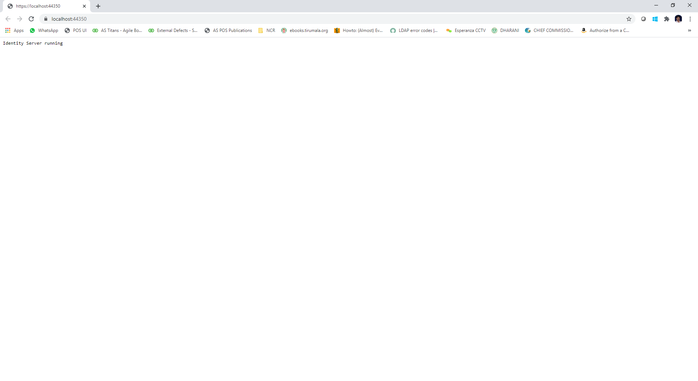
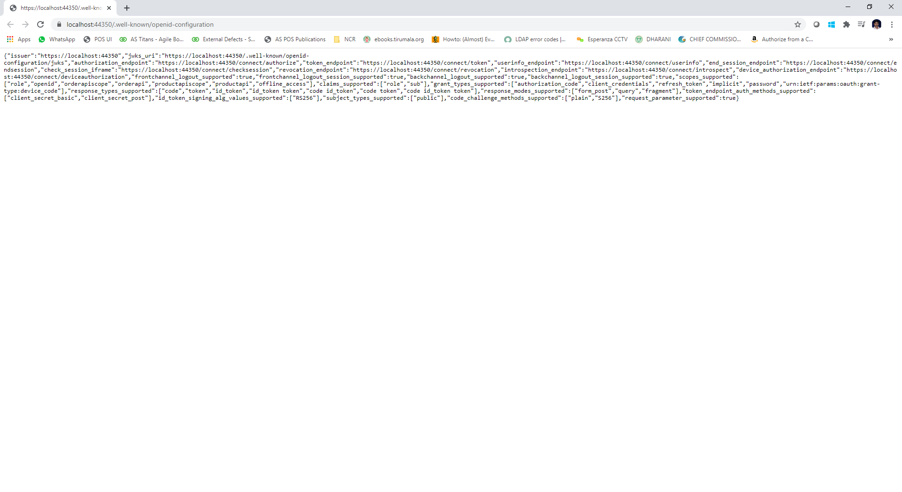
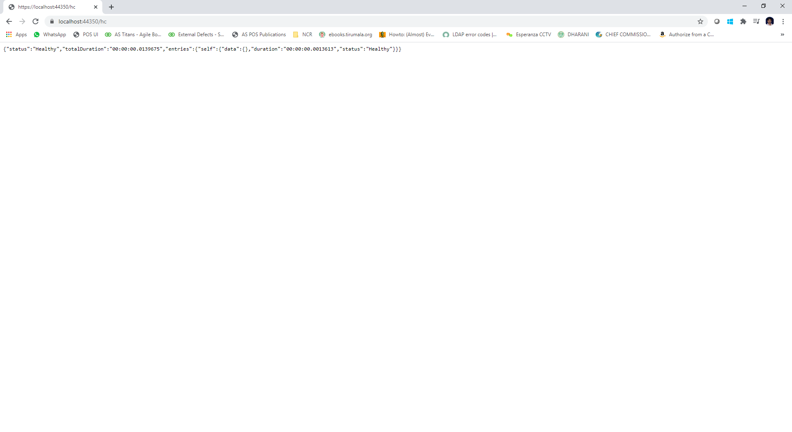
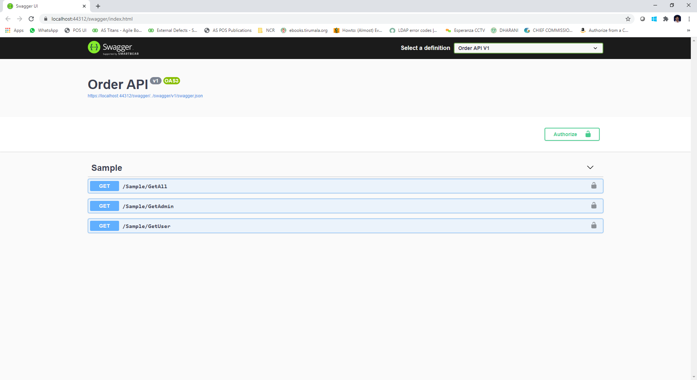
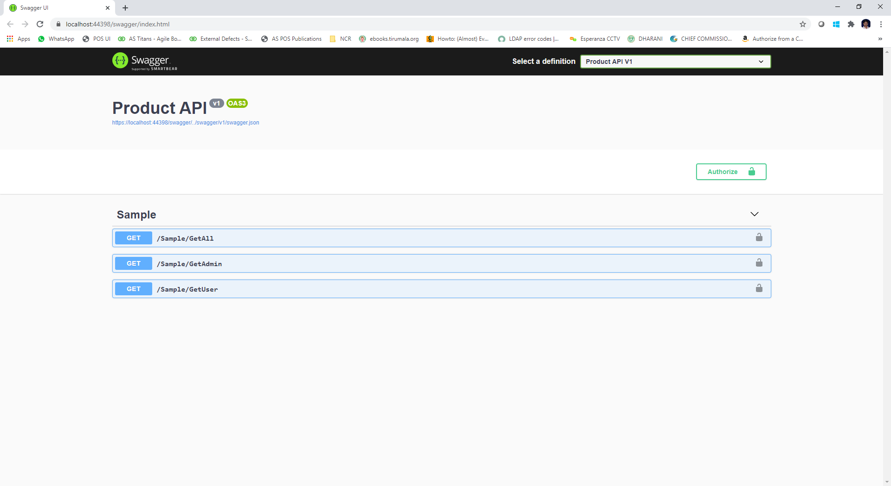
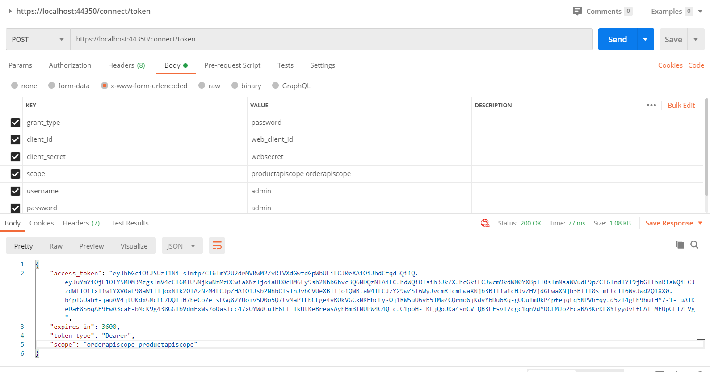
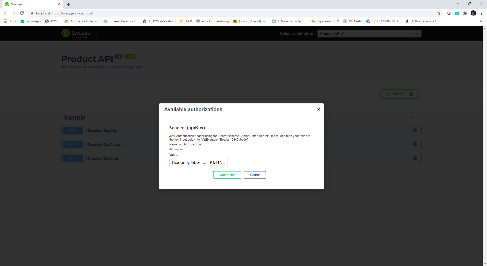

# AspNetCore-WebApi-IdentityServer4

Sample AspNetCore Web API integration with Identity Server 4 and Swagger documentation.

<b>Identity Server 4:</b>

<b>Identity Server 4 OpenId Configuration:</b>

<b>Identity Server 4 Health Status:</b>

<b>Order Web Api Swagger:</b>

<b>Product Web Api Swagger:</b>

<b>Get token from Identity Server 4:</b>

<b>Pass token to web api's by clicking on Authorize button:</b>
